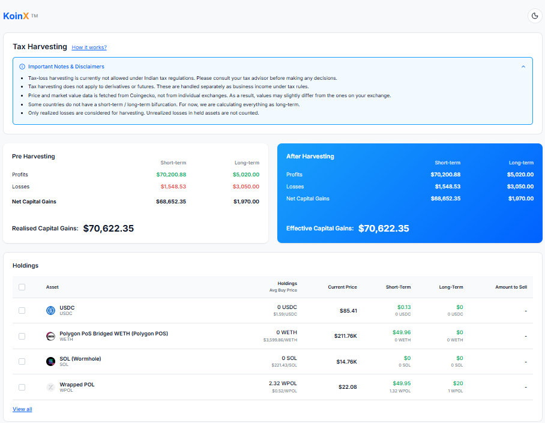
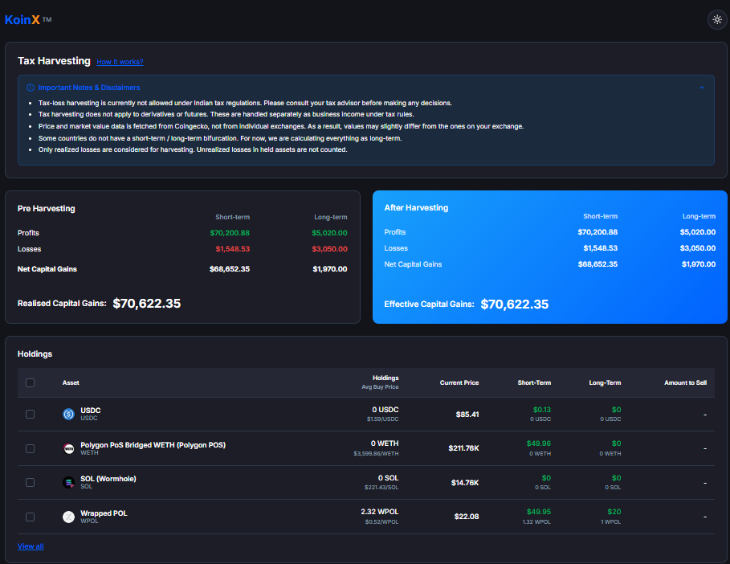

# KoinX — Tax Loss Harvesting Tool

A responsive, dual-themed Tax Loss Harvesting dashboard built with **React.js**.
Helps users visualize and optimize their crypto capital gains by simulating asset sell scenarios in real time.

---

## Screenshots

### Light Mode



### Dark Mode



---

## Live Demo

[View Live App on Vercel →](https://koin-x-orcin.vercel.app)

---

## Getting Started

### Prerequisites

- Node.js v18+
- npm or yarn

### 1. Clone the Repository

```bash
git clone https://github.com/your-username/koinx-assignment.git
cd koinx-assignment
```

### 2. Install Dependencies

```bash
npm install
```

### 3. Start Development Server

```bash
npm run dev
```

Open [http://localhost:5173](http://localhost:5173) in your browser.

### 4. Build for Production

```bash
npm run build
```

---

## Features

| Feature | Status |
| --- | :---: |
| Pre Harvesting Capital Gains card | Done |
| After Harvesting Capital Gains card | Done |
| Real-time harvesting calculation on selection | Done |
| Holdings table with checkbox selection | Done |
| Select All / Deselect All | Done |
| Multi-column Sorting (Asset, Holdings, Prices, Gains) | Done |
| View All / Show Less pagination | Done |
| Exact-Value Hover Tooltips across entire table | Done |
| "How it works?" popup modal | Done |
| Animated Loader (react-loader-spinner) | Done |
| Error state with retry button | Done |
| Light / Dark theme toggle | Done |
| Mobile responsive design | Done |
| Mock API using Promises | Done |

---

## Business Logic

### Pre-Harvesting

```
Net Short-Term Gains   = stcg.profits − stcg.losses
Net Long-Term Gains    = ltcg.profits − ltcg.losses
Realised Capital Gains = Net Short-Term + Net Long-Term
```

### After-Harvesting (when assets are selected)

For each selected asset:

- If `stcg.gain > 0` → added to `stcg.profits`
- If `stcg.gain < 0` → its absolute value is added to `stcg.losses`
- Same logic applies for `ltcg`

```
Effective Capital Gains = Updated Net STCG + Updated Net LTCG
Savings                 = Realised Capital Gains − Effective Capital Gains
```

> The **Savings** banner is shown only when selecting assets reduces Effective Capital Gains below the original Realised Capital Gains.

---

## Folder Structure

```
src/
├── components/
│   ├── Header.jsx           # App header with theme toggle
│   ├── TaxHarvesting.jsx    # Main page orchestrating data + UI
│   ├── GainsComparison.jsx  # Pre/Post harvesting comparison cards
│   ├── HoldingsTable.jsx    # Interactive holdings table with sort & select
│   └── SkeletonLoader.jsx   # Loading skeleton UI
├── context/
│   └── ThemeContext.jsx     # Global Light/Dark theme state
├── hooks/
│   └── useTaxHarvesting.js  # Core business logic hook
├── services/
│   └── mockApi.js           # Promise-based mock API
├── utils/
│   └── formatters.js        # Currency & number formatting helpers
├── styles/
│   └── components.css       # Component-level CSS
├── index.css                # Global CSS variables & reset
└── App.jsx                  # Root component
```

---

## Tech Stack

| Technology | Purpose |
| --- | --- |
| React 19 | UI framework (functional components + hooks) |
| Vite 8 | Build tool & dev server |
| Vanilla CSS | Styling with CSS Custom Properties for theming |
| Lucide React | Icon library |
| react-loader-spinner | High quality animated loading states |
| Mock API | Promise-based data simulation (no backend needed) |

---

## Assumptions

1. All holdings from the API are treated as current holdings — no quantity threshold filtering is applied.
2. Losses are stored as **positive numbers** in the API (`stcg.losses`, `ltcg.losses`). Net is computed as `profits − losses`.
3. For selected assets, if `stcg.gain` is positive the full gain is added to `profits`; if negative, its absolute value is added to `losses` — mirroring a real sell simulation.
4. The Savings banner is shown only when the selection yields a net reduction in Effective Capital Gains.
5. Current Price data is sourced from CoinGecko (mocked in this project) and may differ slightly from live exchange prices.
6. `averageBuyPrice` of `0` represents assets acquired at no cost (airdrops, forks, staking rewards, etc.).

---

## License

MIT License — feel free to use and modify for personal or educational purposes.